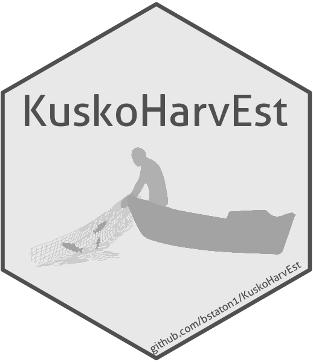
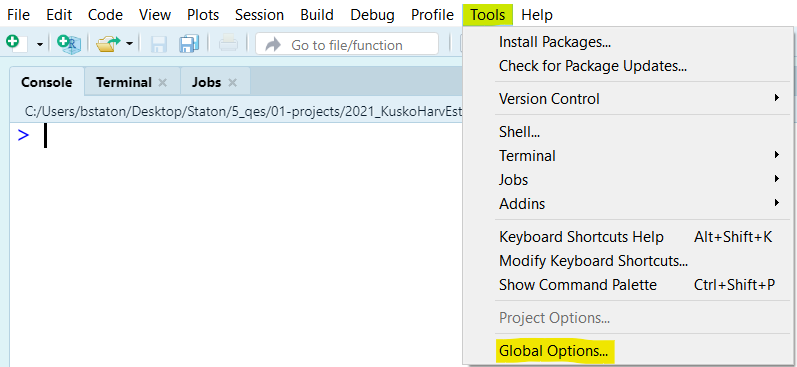
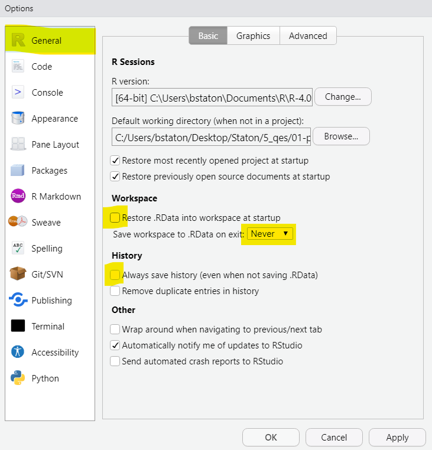
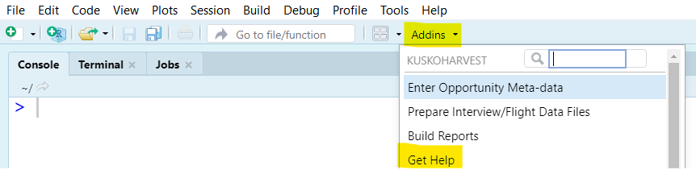
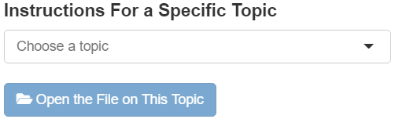
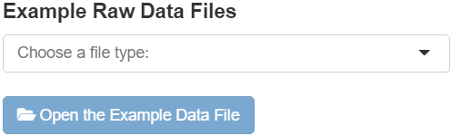
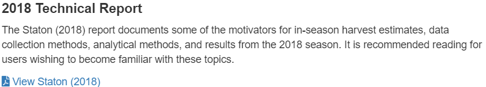

# KuskoHarvEst 

> R package that provides an interactive and reproducible workflow for creating and reporting in-season harvest and effort estimates for the Lower Kuskokwim River subsistence salmon fisheries.
>
> Its intent is to convert a process that was previously driven by "copy, paste, edit, repeat" on code files (thereby sometimes subjective and error-prone) into one that is menu-driven, intuitive, and automated. **Importantly, it requires no knowledge of R programing to conduct estimation and create the standardized reports.**

## Computer Set Up

To use 'KuskoHarvEst', you'll need to first download several programs, install them, and install some packages (extensions) of these programs. It is essential that you perform these tasks in the order described below. 

> **NOTE**: you will need a stable internet connection to complete all of these steps. Depending on your internet download speed, these tasks will take some time (should not take more than a half hour). These steps only need to be done once per computer. 

### R & RStudio

> **NOTE**: If you already have R and RStudio, but they were installed later than in the last ~6-12 months, it is advised that you uninstall the older versions and install the newest versions. Be sure to use the correct version for your operating system (for example, Mac or Windows).

* [Program R](https://cran.rstudio.com/): this is the program that runs the code, but the interface is entirely code-based and not easy to work with.
* [RStudio Desktop](https://www.rstudio.com/products/rstudio/download/): this is a program that makes working with R much easier, and allows construction of custom  interactive interfaces (drop down menus, text entry boxes, etc.).

After downloading the programs, you must install them. You may need administrative privileges to do this - if so and you do not have them, contact your organization's Information Technology specialist for help (you will not need administrative privileges for any other steps). During the installation process, you will be presented with several options - you can accept the defaults in all cases (just keep clicking the "Next" button until you get a window saying the software was successfully installed).

### R Packages

Once you have installed RStudio, open it, paste the code below in the console and press <kbd>ENTER</kbd>. This will install   nearly everything you need to create harvest estimates. Many additional R packages will be installed automatically.

```R
install.packages("remotes")
remotes::install_github("bstaton1/KuskoHarvEst")
```

### LaTeX Distribution and Additional Packages

LaTeX is a program that allows building PDF documents from code. 'KuskoHarvEst' depends on '[tinytex](https://yihui.org/tinytex/)', which is an R package that installs a minimal LaTeX distribution (<0.1GB in size) and allows you to install extensions as needed. After the code from the previous step is done running, type this code into the console and press <kbd>ENTER</kbd>:

```R
tinytex::install_tinytex()
```

'KuskoHarvEst' requires several LaTeX packages in addition to those installed by default - these control specific features of the appearance of the PDF documents. When the above code is done running, copy this code into the RStudio console and press <kbd>ENTER</kbd>:

```R
tinytex::tlmgr_install(pkgs = c(
  "sansmathfonts", "setspace", "titlesec", "footmisc",
  "microtype", "caption", "floatrow", "multirow",
  "colortbl", "wrapfig", "pdflscape", "tabu",
  "varwidth", "threeparttable", "threeparttablex",
  "environ", "trimspaces", "ulem", "makecell",
  "fancyhdr", "draftwatermark", "parskip"
))
```

### Optional (But Recommended)

There is one more thing that will make your life easier. RStudio by default will save files you do not ever need: `.Rdata` and `.Rhistory`. In my opinion, they do nothing but create clutter. You can prevent RStudio from saving them by following these steps:

First, navigate to the "Tools" menu in RStudio, then select "Global Options":

<p align="center">
  
</p>

Then, make sure your settings look just like the highlighted ones below, and click "Apply" and "OK":

<p align="center">
  
</p>

## The Estimation/Reporting Workflow

You will interact with intuitive menu-driven interfaces provided by KuskoHarvEst' to create documents that summarize the data and results of harvest estimation for a given harvest opportunity. Your workflow for a given opportunity will be:

1. Gather the raw data files and ensure all data appear reasonable and files are formatted properly\*
2. Create a new R project and include the raw data files within it
3. Enter the "meta-data" for the opportunity (date/times, gear types allowed, etc.)
4. Process the raw data files into a standardized format, which includes automated screening of interview data for potentially unreliable information
5. Produce the reports (one for the main summary and one for sensitivity analyses), which are automatically populated with the inputs and outputs of each analysis

This means the only things you will edit directly are either (a) in the data files or (b) contained in a straight-forward interface. No copy/pasting/editing of code is required to complete this workflow. In step (4), you may find some data entry problems. If that is the case, simply close the interface and edit the raw data to correct the problem, and start step (4) over.

> \*Improperly formatted/entered data will be the number one cause of errors you see (hopefully you see none!), so pay extra care to this topic.

## Documentation

It is recommended that you review the documentation for 'KuskoHarvEst' before using it. Lots of information is available through the built-in "Help" tool, available through the "Addins" menu at the top of RStudio:

<p align="center">
  
</p>

There are dedicated documents with step-by-step instructions and general guidance on how to use each interactive tool and more, accessible through this menu in the 'KuskoHarvEst' help tool:

<p align="center">
  
</p>
The key documentation for all users is labeled "General Instructions" and "How To". Further documentation is accessible here for users interested in learning about how the code framework operates, which quality assurance checks are performed on the interview data, and how to generate content (tables and figures) for the end-of-season final report.

Additionally, users can find example data files to illustrate precisely how the individual raw data files should be formatted.  These are accessible through this menu in the 'KuskoHarvEst' help tool:

<p align="center"> 
   
</p>

Users new to in-season Kuskokwim River subsistence harvest monitoring and estimation are advised to read the Staton (2018) report - it details the data collection and analytical methods. This is accessible by clicking the link in this section of the 'KuskoHarvEst' help tool:

<p align="center">
  
</p>
## Contact

If users are uncertain with how to properly use an aspect of the tool and cannot find the answer in the documentation, they are encouraged to contact the developer of the software: Ben Staton (<bstaton.qes@gmail.com>).

The developer should also be contacted in the event of a major change to the sampling protocol. 'KuskoHarvEst' relies on specific sampling characteristics (specifically, that sampling is conducted similarly to the 2016-2021 seasons) and some sampling changes may lead to incompatibility with 'KuskoHarvEst' or cause it to produce unreliable output.

## Acknowledgements

Several people provided valuable feedback on the functionality included in this package, in alphabetical order they are: B. Bechtol, G. Decossas, J. Esquible, D. Lowrey, J. Spaeder, K. Russell, and K. Whitworth. L. Coggins co-developed the statistical foundations of the harvest/effort estimators with B. Staton starting in 2016, with earlier work done in 2015. The graphic of the fisher in the 'KuskoHarvEst' package logo was created by N. Tamburello. 

This package is totally reliant on [RStudio Desktop](https://www.rstudio.com/products/rstudio/), [Rmarkdown](https://rmarkdown.rstudio.com/), and [Shiny](https://shiny.rstudio.com/) to do its job. The developers of these  free software products are owed gratitude for making the construction of intuitive workflows like those contained in 'KuskoHarvEst' possible. 

Funding for the development of this package was provided by the Kuskokwim River Inter-Tribal Fish Commission, administered by the Bering Sea Fisherman's Association through grant #AC-2101 to Quantitative Ecological Services, LLC for the project period January and October, 2021. The initial development of the statistical and reporting framework, off of which 'KuskoHarvEst' is based, was funded by the U.S. Fish and Wildlife Service through a Pathways Position during the summers of 2016-2018.
