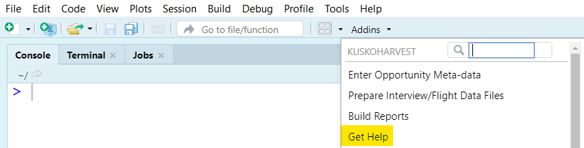
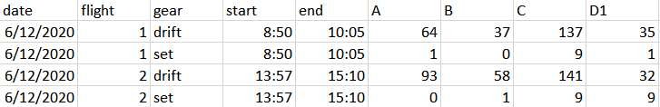
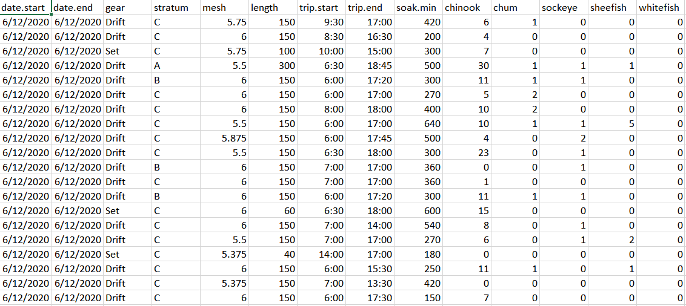
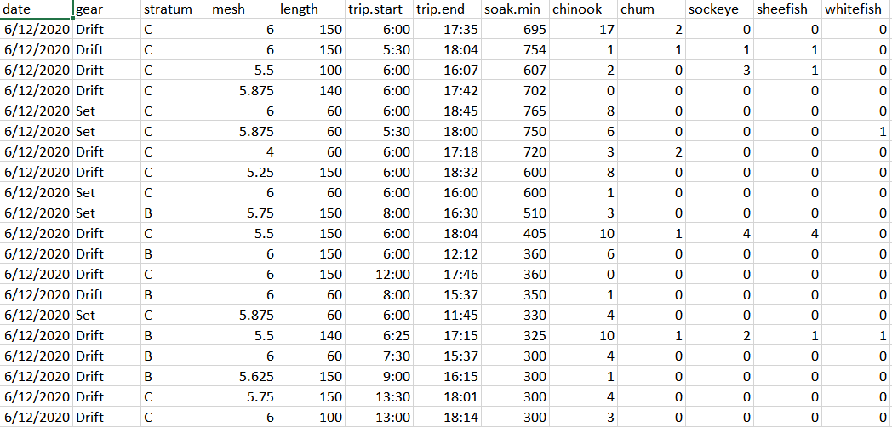
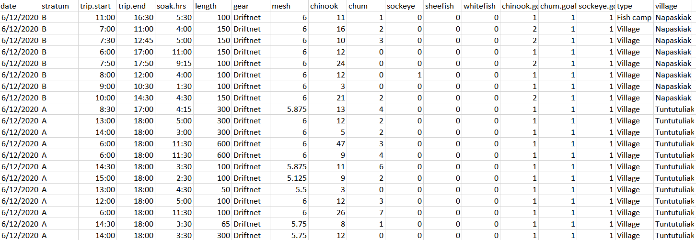

---

```{r setup, include=FALSE}
knitr::opts_chunk$set(echo = TRUE)
```

_This document describes formatting required of the files that store interview and flight data. **Pay particularly close care to how these data are entered and formatted, as inconsistency in the input may cause steps later in the workflow to fail.**_

Harvest estimation relies on completed trip fisher interviews and aerial counts of the number of trips active at a given time.
By design, entering, formatting, and checking these data will be the most difficult part of your job in producing an estimate.

The length of this document may make this seem complicated -- and it may be at first -- but this document is meant to be comprehensive (that is, explains _everything_).

If at any time you need a quick reminder about which variables are needed and how they should be formatted for the program to work, you can access example data files using the 'KuskoHarvEst' help tool through the RStudio addins menu:

<p align="center">
  
</p>

# Conventions

### Verbatim

The exact formatting of different data values and column headers is essential. To emphasize a reference to something exactly verbatim, `this font` is used throughout this document.

### Dates

**The month, day, year, minute, and hour must be entered in a specific format**.
Below, MM/DD means that two digits for the month and two digits for the day are required.
M/D means that only one digit may be used. For example June 5 in MM/DD format must be `06/05`, whereas in M/D format it must be in `6/5` (June 12 would be `6/12` for M/D). This concept extends to times expressed as hours:minutes (H:MM).

**Dates entered into data cells must be in M/D/YYYY format**.
For example, June 24, 2020 should be entered `6/24/2020`.

**Dates in file names should be in YYYY_MM_DD format**.
For example, June 24, 2020 should be entered `2020_06_24`.

### Times

**Times (as in time of day) entered into data cells must be in H:MM format and on the 24 hour clock (i.e., military time)**.
For example, 8:00 AM is `8:00`, 11:45 AM is `11:45`, 1:30 PM is `13:30`.

### Missing Data

Each row in the interview data files will be an individual interview.
**If an interview has some data available, but some are missing, the missing cells should have `NA` entered into them. Do not leave missing cells totally empty.**

### One Date Per File

**The raw data files must have data from one calendar day only.**
The exception is if a trip started on one day and ended on the next -- see the section on dates in interview files below for details.

### CSV File Format

**All raw data files must be in CSV file format.**
This is basically a spreadsheet that contains only data (no formulas).
You will edit data files using Excel or a similar spreadsheet software. 

If you have been provided data files in XLSX file format, open the file in Excel and go to File > Save As > File Type > Comma Separated Values (CSV). 

# Flight Data File {.tabset .tabset-pills}

Click each of the sections below to get information about how file names and variables should be entered, as well as a screenshot of an example data file. 

## Required File Names

The file storing raw flight data **must** be named `Flight_counts_YYYY_MM_DD.csv`.

## Required File Contents

The flight data file **must** contain these columns.

#### `date`

The date the flight was conducted (entered in M/D/YYYY format).

#### `flight`

A numeric flight identifier.
For example, rows corresponding to the first flight of the day would have `1` in this column, same for `2` and the second flight of the day.

#### `gear`

The type of gear corresponding to the counts. Must be one of `drift` or `set`.

#### `start`

The time the observer started searching for nets -- generally several minutes after take off.
Must be entered in military time with H:MM format.

#### `end`

The time the observer stopped searching for nets.
Must be entered in military time with H:MM format.

#### Stratum-specific Counts

Column names should be the letters corresponding to the area the count was made.
If a stratum was missing, do not include a column for it.

These areas are accepted:

```{r strata-table, echo = FALSE}
tab = KuskoHarvEst:::strata_names
colnames(tab) = c("Stratum", "Downstream", "Upstream")
kableExtra::kable(tab) |>
  kableExtra::kable_styling(full_width = FALSE, bootstrap_options = c("condensed")) |>
  kableExtra::add_header_above(c(" " = 1, "Boundary" = 2), bold = TRUE)
```

## Example Screenshot

Here is an example of a case with two flights conducted in a day where both drift and set nets were allowed:

<p align="center">
  
</p>

Each row stores the counts made for one gear type on one flight in each geographic stratum.
If there were three flights, there would be two more rows containing the drift and set counts and flight times for the third flight as well.

If the opportunity allowed only set net gear, **keep the "drift" rows but insert zeros for the count values** on each flight.

# Interview Data Files {.tabset .tabset-pills}

Interview data files are more complicated than the flight data file.
There will likely be several data files (one per source per day).

Click each of the sections below to get information about how file names and variables should be entered, as well as a screenshot of an example data file. 

## File Name Requirements

The files storing raw interview data **must** be named `SOURCE_YYYY_MM_DD.csv`, where `SOURCE` is replaced by the data source that collected the data.
Typically, these will be one of:

* `BBH`: for interviews conducted at the Bethel Boat Harbor
* `CBM`: for interviews conducted by the Community Based Harvest Monitoring program
* `FC`: for interviews conducted at Bethel area fish camps (by ONC).

In the past, these sources have been used as well:

* `LE`: for interviews conducted by USFWS law enforcement officers
* `ADFG`: for interviews conducted by ADF&G Subsistence Division

## Required File Contents

Each row in the data set is a unique interview.
No cells should be empty within a row -- if a value is not available, insert `NA`.
The order of the columns does not matter, but the column names must be identical to those described below and the cells in each column must be formatted as described.

#### Date(s)

The date(s) the trip occurred on, entered as M/D/YYYY format.
There are two options here:

1. Have one column called `date`. This is usable if all trips started and ended on the same day.
2. Have one `date.start` and one `date.end` column, where each stores the start and end date of each trip. This is included to handle (rare) cases where a set net may be set overnight -- fishing started on one day and ended the next. 

Using option (1) will cause the program to return a warning later on:

```{r, echo = FALSE, comment = NA}
cat("Warning: Only the 'date' column was found in the raw data, not 'date_start' and 'date_end'.\nIt is thus assumed that all trips started and ended on the same date.")
```

Thus, option (2) is preferable to use in all cases because it is explicit -- if all trips began and ended the same day, then the two columns will be identical for each row.

Interview data should be placed in the data file corresponding to the day the trip started.
So for example, if you have a trip that started on one day and ended the next day, it should go in the data file that includes other interviews that started on that same day, even though the end date is different.

#### `stratum`

```{r, echo = FALSE}
accepted_strata = knitr::combine_words(c(KuskoHarvEst:::strata_names$stratum, "NA"), before = '`', and = ' or ')
```

The geographic stratum in which the majority of the fishing trip occurred.
Must be one of `r accepted_strata`; records with any other value (e.g., area `O` for "other") will be discarded automatically later with a warning:

```{r, echo = FALSE, comment = NA}
cat("Warning: There were X records with invalid stratum values: O.\n  They have been discarded.")
```

#### `gear`

The type of gillnet used by the fisher (non-gillnet gears should not be included in the data set).
Can be formatted several ways, acceptable options are: `drift`, `driftnet`, `set`, or `setnet` (or capitalized versions of these).

#### `length`

The length of the gillnet used by the fisher (in feet).
Fishers will commonly report net length in fathoms.
One fathom = 6 feet.

#### `trip.start`

The time the fisher departed for their fishing trip, entered in military time as H:MM format.

#### `trip.end`

The time the fisher ended their fishing trip, entered in military time as H:MM format.

#### Soak Time

The fisher's best approximation of how long their net was actively fishing for.
There are several acceptable ways to enter this:

* A column called `soak.min` with the number of minutes of soak time, for example, a trip that fished actively for 1.25 hours would be entered `75`.
* A column called `soak.hrs` with the number of hours of soak time, for example, a trip that fished actively for 1.25 hours would be entered `1.25`.
* A column called `soak.hrs` with the soak time elapsed entered as H:MM, for example, a trip that fished actively for 1.25 hours would be entered `1:15`.

#### Catch

There will be columns for the number of fish harvested per species reported by the fisher.
Each species will have a different column; these species are accepted:

```{r species-table, echo = FALSE}
tab = KuskoHarvEst:::species_names
tab2 = data.frame(
  "Species" = KuskoHarvUtils::capitalize(tab$species),
  "Enter As" = paste0("`", tab$species, "`")
  )
tab2$Species = ifelse(tab$is_salmon, paste0(tab2$Species, " salmon"), tab2$Species)
knitr::kable(tab2, escape = FALSE, col.names = c("Species", "Column Title")) |>
  kableExtra::kable_styling(full_width = FALSE, bootstrap_options = c("condensed"))
```

If no data are available for a species, you may omit the column for that species entirely.
Only enter a zero if the data sheet has a zero for that species and interview, if the data sheet has an empty cell, use `NA`.

## Optional File Contents

These are columns that are not required in the interview data to produce the primary estimates, but some optional features of 'KuskoHarvEst' rely on some of them. 

#### `mesh`

The mesh size of the gillnet used by the fisher on their trip. Measured in inches of stretched mesh. Must be formatted as a number (possibly with decimals). **Fractions (e.g., `5 7/8`) are not accepted and will cause the software to crash and should instead be formatted as decimals.** _This variable is not currently used by any aspect of 'KuskoHarvest'_.

#### `type`

The type of interview conducted, for example, in person at the primary village fishery access point (`Village`), at a fish camp (`Fish Camp`), or over the phone (`Phone`). Typically found only in CBM files. _This variable is not currently used by any aspect of 'KuskoHarvEst'_.

#### `village`

The village in which the interviewer is stationed. Typically found only in CBM files. _This variable is not currently used by any aspect of 'KuskoHarvEst'_.

#### Harvest Goal Attainment

Some interviews ask fishers to report their progress towards meeting their desired total harvest for Chinook salmon for the season.
They have four response options:

```{r goal-table, echo = FALSE}
tab = 
tab2 = data.frame(
  "Category" = paste0(c("Under halfway", "Halfway", "Over halfway", "Completely"), " done"),
  "Enter As" = paste0("`", 1:4, "`")
  )
knitr::kable(tab2, escape = FALSE, col.names = c("Category", "Enter As")) |>
  kableExtra::kable_styling(full_width = FALSE, bootstrap_options = c("condensed"))
```

Enter these values in columns with the name `SPECIES.goal`, where `SPECIES` is replaced with the species in question; e.g., for Chinook, chum, and sockeye salmon, you would have three columns titled `chinook.goal`, `chum.goal`, and `sockeye.goal`.
The cell in each column stores the response (`1`, `2`, `3`, `4`, or `NA` if no response).

When available, these data are typically found only in CBM files.

## Example Screenshots {.tabset .tabset-pills}

Below you will find three examples of how these data have been entered in the past (6/12/2020 used here; first 20 records from each data source displayed). 
You can access the actual files behind these screenshots through the 'KuskoHarvEst' help tool from the RStudio addins menu:

<p align="center">
  
</p>

### FC

A couple things to note about this data file:

* Uses the `date.start` and `date.end` approach to specifying dates -- **this is the recommended method**
* Soak time entered using the `soak.min` option
* No `chinook.goal`, `chum.goal`, `sockeye.goal` columns included

<p align="center">
  
</p>

### BBH

A couple things to note about this data file:

* Only one `date` column used, recall this will return a warning but it can be safely ignored if all trips started and ended the same day
* Soak time entered using the `soak.min` option
* No `chinook.goal`, `chum.goal`, `sockeye.goal` columns included

<p align="center">
  
</p>

### CBM

A couple things to note about this data file:

* Only one `date` column used, recall this will return a warning but it can be safely ignored if all trips started and ended the same day
* Soak time entered using the `soak.hrs` military time option
* Contains `chinook.goal`, `chum.goal`, `sockeye.goal` columns

<p align="center">
  
</p>
