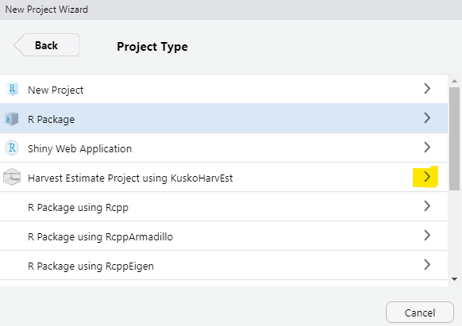
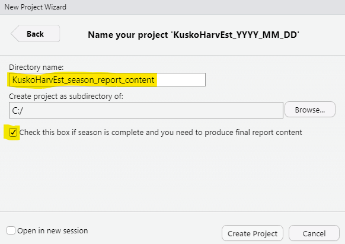
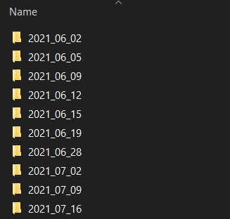
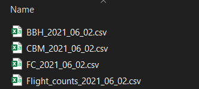
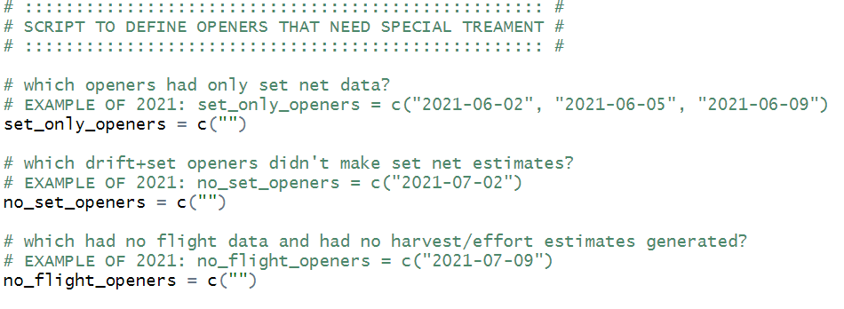
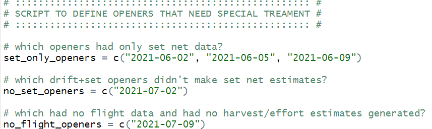
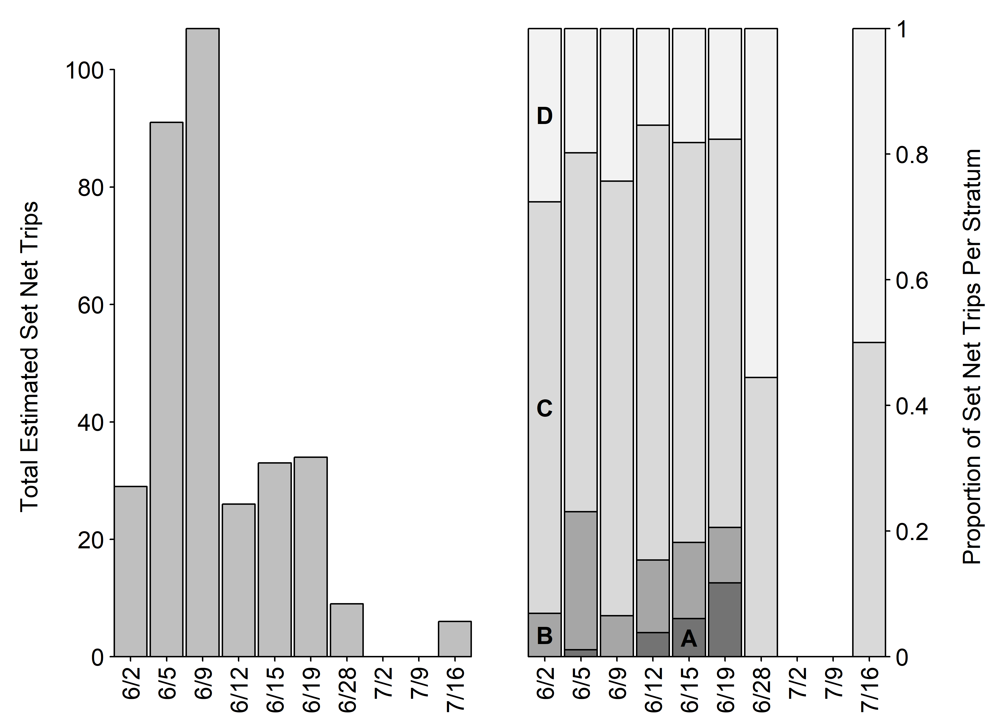

---

```{r setup, include=FALSE}
knitr::opts_chunk$set(echo = TRUE)
```

_This document provides an overview of the capabilities included in 'KuskoHarvEst' for producing figures and tables that can be placed in the final (i.e., season-wide summary) report, similar to those found in Staton (`r KuskoHarvEst:::link_to_doc("Staton - 2018 - In-season harvest and effort estimates.pdf", "2018")`)._

**The steps described here are only to be completed after the last harvest opportunity of the year and after all raw data sets have been finalized. This is part of the post-season workflow, not the in-season workflow.**

The final reports summarize all data and harvest estimates obtained from a single season of monitoring. You may be tasked with producing the content (i.e., figures and tables) for these reports, but doing this "by-hand" is very cumbersome and error-prone. That is because the estimates are produced for each opportunity (i.e., day of fishing) at a time in-season, but the final report content needs to combine the output across opportunities that occurred that season. For this reason, 'KuskoHarvEst' contains a feature to automate this process for you.

**NOTE**: this post-season workflow will involve some (hopefully very limited) viewing and editing of R code. The aspects that should need editing are clearly defined here, but if you have no experience with R code, you may wish to contact someone who does for help.

# Create a New RStudio Project

To create a new R project, go to the "File" menu within RStudio, and select the highlighted option:

<p align="center">
  
</p>

This window will pop up, select the highlighted option:

<p align="center">
  
</p>

Which will take you to this page, select the highlighted option:

<p align="center">
  
</p>

Although optional, you are advised to name the project "KuskoHarvEst_YYYY_final_report_content", but replace "YYYY" with the current year.
**Make sure the highlighted check box shown below is checked** and click "Create Project".

<p align="center">
  
</p>

After you click "Create Project", RStudio will open that project.

# Include Raw Data Files

In your file explorer, open the location of your new project. 
You'll notice an empty folder named `raw-data-files`. 
You must place the raw data files from each opportunity in this folder.
Here is an example of the `raw-data-files` folder contents for the 2021 season:

<p align="center">
  
</p>

Notice there is a separate folder for each opportunity. Each of these subfolders should contain only the data from that opportunity; here is an example of the `raw-data-files/2021_06_02` subfolder:

<p align="center">
  
</p>

**Do not move to the next step until you have organized all data for the season this way.**

# Specify Which Estimates Need Special Treatment

The step after this one will re-run all calculations for each opportunity based on the final data sets you just organized.
There are some cases that require special attention:

1. If the opportunity allowed set nets only and not both set and drift nets
2. If the opportunity allowed both net types but did not have enough set net data to produce an estimate
3. If the opportunity did not have any flight data and effort and harvest estimates could not be produced

This step requires that you enter the dates of the opportunities that meet these conditions.

From RStudio, open the file `00-specify-odd-openers.R`, which will look like this:

<p align="center">
  
</p>

Using 2021 as an example, 

1. June 2, June 5, and June 9 were set net only opportunities
2. July 2 was a drift and set net opportunity with flight data, but did not have enough set net interviews to produce a set net harvest estimate
3. July 9 was a drift and set net opportunity but no effort flights were conducted due to poor weather conditions.

These should be entered like this:

<p align="center">
  
</p>

**Make sure to save your changes to this file before moving on.**

# Recompile All Estimates and Data

This step will re-run all estimation calculations and combine the output together across all opportunities.

From RStudio, open the file `01-compile-all-estimates.R`. No edits to this file should be necessary, but you will need to execute the code. To do this select all of the code and press <kbd>CTRL</kbd> + <kbd>ENTER</kbd> on your keyboard (<kbd>CMD</kbd> + <kbd>ENTER</kbd> for Mac computers).

You will see a progress message telling you which date is being recalculated -- this may take several minutes to complete. You will see a message notifying you when the calculations have been completed.

# Produce All Tables

This step will take the output from the recompilation step and produce output files that contain tables ready to be formatted for the final report.

From RStudio, open the file `02-make-all-tables.R`. No edits to this file should be necessary, but you will need to execute the code. To do this select all of the code and press <kbd>CTRL</kbd> + <kbd>ENTER</kbd> on your keyboard (<kbd>CMD</kbd> + <kbd>ENTER</kbd> for Mac computers).

The output from this code will be stored in a new folder called `tables-for-report`. Examine the files contained here, they can be opened with a spreadsheet program such as Microsoft Excel.

# Produce All Figures

This step will take the output from the recompilation step and produce output files that contain figures ready to be formatted for the final report.

From RStudio, open the file `03-make-all-figures.R`. No edits to this file should be necessary, but you will need to execute the code. To do this select all of the code and press <kbd>CTRL</kbd> + <kbd>ENTER</kbd> on your keyboard (<kbd>CMD</kbd> + <kbd>ENTER</kbd> for Mac computers).

The output from this code will be stored in a new folder called `figures-for-report`. Examine the files contained here. If you detect any problems with the formatting of the figures, the code that produced them can be edited as necessary -- if you are uncomfortable with this, it is advisable to contact someone with knowledge of R code editing to help with this process. The primary issue you may run into is on the figures that look like this:

<p align="center">
  
</p>

The "A", "B", "C", and "D" labels will all be placed on the first date (here, 6/2) by default. However notice on the figure above that there is no room for the "A" label on the first date. You can control which date each label goes on by changing this code (found near line number 90 in `03-make-all-figures.R`):

```
label_bar_A = 1
label_bar_B = 1
label_bar_C = 1
label_bar_D = 1
```

to this:

```
label_bar_A = 5
label_bar_B = 1
label_bar_C = 1
label_bar_D = 1
```

To instruct the code to place the "A" label on the 5th bar instead of the first. Similar changes can be made for the figures showing drift effort estimates (near line 40 in `03-make-all-figures.R`) and breakdown of interview data sources (near line 155). After making changes to the code, you will need to re-execute it to see the change reflected in the output figure file.
