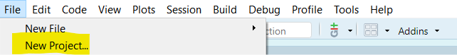
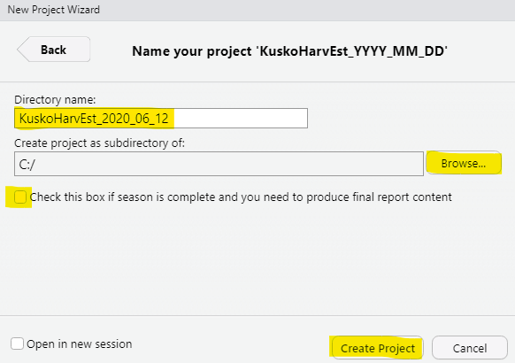
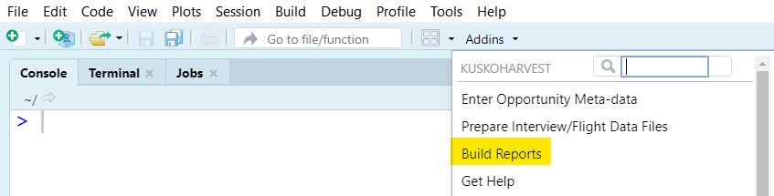

---

```{r setup, include=FALSE}
knitr::opts_chunk$set(echo = FALSE)
```

_This document describes the overall workflow in terms of the order of major tasks you will complete, and how to find the tools you will use to complete each task._

# The In-Season Workflow {-}

You will interact with intuitive menu-driven interfaces contained in 'KuskoHarvEst' to create documents that summarize the data and results of harvest estimation for a given harvest opportunity.
Your workflow for a given opportunity will be:

1. Gather the raw data files and ensure all data appear reasonable and files are formatted properly
2. Create a new R project and place the raw data files
3. Enter the "meta-data" for the estimate (e.g., date and times covered by the estimate)
4. Process the raw data files into a standardized format, including screening interviews for potentially unreliable information
5. Produce the reports (one for the main summary and one for sensitivity analyses), which are automatically populated with the inputs and outputs of each analysis

This means the only things you will edit directly are either (a) in the data files or (b) contained in a straight-forward interface. In step (4), you may find some data entry problems.
If that is the case, simply close the interface and edit the data to correct the problem, and start step (4) over.

# How to Handle Multi-Day Opportunities {-}

The tools provided in 'KuskoHarvEst' **are intended to be used with data from a single calendar day at a time**. The majority of opportunities that have occurred in the past have operated this way and it has not been an issue. However, if you are faced with a case where the fishery is open for example, from noon one day to noon the next day, you will need to do everything twice: once for each day.

# Gather Raw Data

Harvest estimation relies on completed trip fisher interviews and aerial counts of the number of trips active at a given time.
Gathering, entering, formatting, and checking these data will be the most difficult part of your job.
**If there are formatting errors in the raw data files, it will almost certainly cause the program to crash, and the error message you receive will not likely be very informative.**
Because of this, you should pay special attention to the raw data files.
See the documentation about the raw data files (`r KuskoHarvEst:::link_to_doc("01-raw-data.html")`) for more details.

You will need the raw data files before making progress on the rest of the steps in the workflow.

# Create a New R Project

An R project is a folder on your computer that contains everything needed for an analysis.
You will create a new one for each harvest estimate you create.
To create a new R project, go to the "File" menu within RStudio, and select the highlighted option:

<p align="center">
  
</p>

This window will pop up, select the highlighted option:

<p align="center">
  
</p>

Which will take you to this page, select the highlighted option:

<p align="center">
  
</p>

Finally, enter the correct information on this page and click "Create Project".
Although these features are flexible, you are advised to:

* Name the project "KuskoHarvEst_YYYY_MM_DD" (the highlighted example below is for the fishing opportunity that occurred on June 12, 2020).
* Have a consistent folder on your computer where you store all of these harvest estimation projects. **Do not put one harvest estimation project folder within another harvest estimation project folder.**

<p align="center">
  
</p>

**NOTE**: Make sure the checkbox labeled "Check this box if season is complete..." is **unchecked**. See `r KuskoHarvEst:::link_to_doc("07-final-report-content.html")` for details on when to check this box.

After you click "Create Project", RStudio will open that project.
You can see which project is active (or close, open, etc. other projects) from this menu in the upper right-hand corner of RStudio:

<p align="center">
  
</p>

After you are done with this process, you should paste the raw data files (flight and interview data files, formatted as described `r KuskoHarvEst:::link_to_doc("01-raw-data.html")`) into the `data-raw` folder in your new project.

# Enter Estimate Meta-Data

The next step will be to enter some high level information about the opportunity and the estimate.
This includes the date, times, areas of the river monitored, gear types allowed, URLs for readers to get more information about the decision that led to the opportunity, and contact information of the person(s) producing the estimate.
These items are referred to as "meta-data" for the estimate.

The tool that allows you to enter these data can be accessed through the RStudio addin menu shown below, and the specific documentation for using this tool can be found `r KuskoHarvEst:::link_to_doc("02-meta-data-tool.html")`.

<p align="center">
  
</p>

When you are done using this tool, you will notice that a new folder in your project has been created titled `data-use`.

# Prepare Raw Data Files

The next step will be to prepare the raw data files into a standardized format to be used by the program.
This step also automates some quality assurance checks of the data. 

The tool that allows you to perform these tasks can be accessed through the RStudio addin menu shown below, and the specific documentation for using this tool can be found `r KuskoHarvEst:::link_to_doc("03-interview-flight-data-tool.html")`.

<p align="center">
  
</p>

When you are done using this tool, you will notice that new files storing the options, standardized interview data, and and standardized flight data are now placed in the `data-use` folder in your project.

# Build Reports

The last step in the workflow is to create the estimates and produce the reports.
'KuskoHarvEst' uses a framework called Rmarkdown which enables conducting an analysis and embedding the results within a PDF document.
This means you will never have to type anything in the report document -- the output will be automatically generated based on the input data and a set of rules for how to conduct the analysis.
In this step, you will perform both the main estimation that will eventually be reported to managers and stakeholders and the sensitivity analyses which provide information about how reliable the estimate is.

The tool that allows you to perform these tasks can be accessed through the RStudio addin menu shown below, and the specific documentation for using this tool can be found `r KuskoHarvEst:::link_to_doc("04-report-builder-tool.html")`.

<p align="center">
  
</p>

# Post-Season Workflow {-}

After each season, a season-wide summary report has been written by the primary analysts that season. The report contains many figures and tables and 'KuskoHarvEst' contains some features to help you make this content at the end of the season. See See `r KuskoHarvEst:::link_to_doc("07-final-report-content.html")` for more details.
