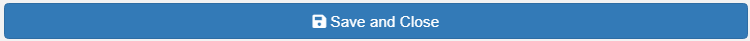

---

```{r setup, include=FALSE}
knitr::opts_chunk$set(echo = FALSE)
```

_This document describes how to use the meta-data tool, where you will enter specific information about the fishery opening and data collection in a standardized form._

**Steps to Complete Before Using this Tool**:

1. Create a new R project (instructions `r KuskoHarvEst:::link_to_doc("00-general.html")`)
2. Organize the raw data files and place them in the `data-raw` folder of your project (instructions `r KuskoHarvEst:::link_to_doc("01-raw-data.html")`)

After you have completed these steps, you are ready to proceed to the meta-data entry step. Navigate to the RStudio addins menu, and select the highlighted option:

<p align="center">
  
</p>

This window will open within RStudio:

<p align="center">
  
</p>

Clicking the link that says "Get Help with Using this tool" will open this document.

### Date/Time Information

This first block of entry boxes is where you will enter the date and times for the day the fishery was open and that the estimates pertain to:

<p align="center">
  
</p>

You can either type the date in directly in MM-DD-YYYY format, or you can use the day selector to ensure the date is formatted properly:

<p align="center">
  
</p>

For the times, enter the minutes and hours of the start time and end time of the opportunity that occurred that day. A couple things to emphasize here:

* Be sure to use military time (the 24-hour clock) -- the above example shows an opportunity that started at 6:00 AM and ended at 6:00 PM the same day.
* If the opportunity was truly all day (i.e., from midnight to midnight), then enter the date as the day of fishing, enter the start time as `00:00`, and enter the end time as `23:59`.
* Remember, this program allows producing harvest estimates for one day at a time only.

### Special Action Information

Generally, the harvest opportunity will be authorized by an official announcement and readers of the output document may be interested in gaining more information about it. Using these boxes:

<p align="center">
  
</p>

You can enter this information:

* The announcement number (for example, `3-KS-03-20` for the Federal Emergency Special Action that announced the 6/12/2020 opportunity)
* The weblink to access the announcement document (for example, <https://www.doi.gov/sites/doi.gov/files/uploads/3-ks-03-20-signed.pdf> for 6/12/2020)
* The weblink to access the news release of the announcement (for example, <https://www.fws.gov/uploadedFiles/2020_3-KS-03-20_News%20Release%20FINAL.pdf>)

**NOTE**: these particular links may not work indefinitely, but they were active at the time of first writing (9/19/2021).

**NOTE**: this information is optional to include, but you are recommended to include it if it is available.

### Contact Person(s)

If readers of the output documents have questions about the data or analysis, they should know who to contact. You can enter this here:

<p align="center">
  
</p>

Although it is optional, you are recommended to include the contact information for the person(s) who created the harvest estimates. You are recommended to use the format `Person 1 (p1@email.com), Person 2 (p2@email.com)` if there are multiple people involved.

### Set Net Only Opportunity

If the opportunity allowed only set nets (and not both set and drift nets), then **it is critical** that you check this box at the bottom of the tool:

<p align="center">
  
</p>

### Save and Close

When you are done entering this information, you **must** click the "Save and Close" button at the bottom of the tool:

<p align="center">
  
</p>

This creates a file in the `data-use` folder in your project with the name `YYYY_MM_DD_meta.rds` and the tool will be closed automatically. You will not be able to open this file directly -- it is used by R automatically in later steps. If you need to change the meta-data, relaunch this tool and start over.

If you wish to exit the tool without saving the output, you may click the "Done" button at the top right.

<p align="center">
  
</p>
