---

```{r setup, include=FALSE}
knitr::opts_chunk$set(echo = FALSE)
```

_This document describes how to use the interview/flight data preparation tool, where you will load and process the data, explore the output of the automated quality assurance checks, examine at other aspects of the raw data, and save standardized files that the program will use in later steps._

**Steps to Complete Before Using this Tool**:

1. Create a new R project (instructions `r KuskoHarvEst:::link_to_doc("00-general.html")`)
2. Organize the raw data files and place them in the `data-raw` folder of your project (instructions `r KuskoHarvEst:::link_to_doc("01-raw-data.html")`)
3. Enter the opportunity meta-data (instructions `r KuskoHarvEst:::link_to_doc("02-meta-data-tool.html")`)

After you have completed these steps, you are ready to proceed to the interview/flight data preparation step. Navigate to the RStudio addins menu, and select the highlighted option:

<p align="center">
  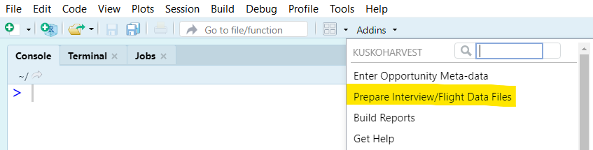
</p>

This window will open within RStudio:

<p align="center">
  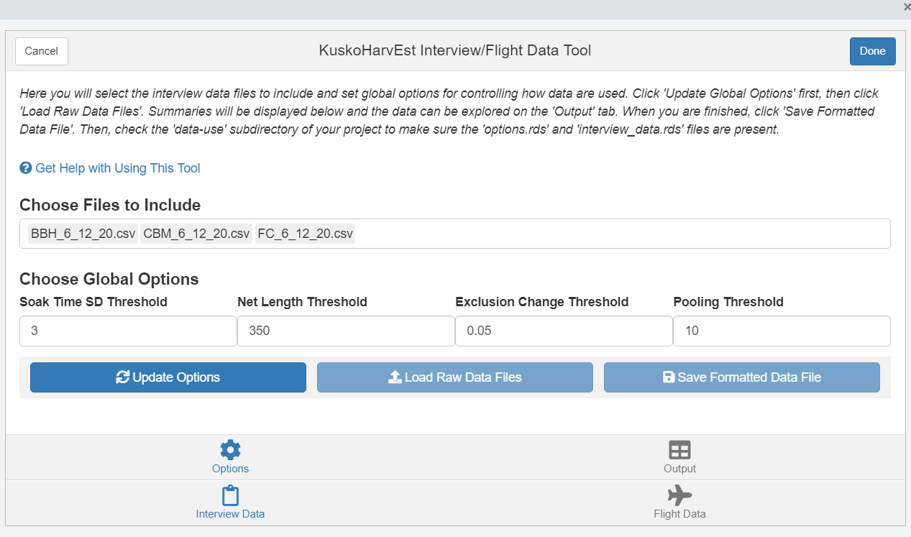
</p>

Clicking the link that says "Get Help with Using this tool" will open this document.

**NOTE**: this tool checks to make sure you have completed the steps leading up to it, and will return errors if it detects a problem.

* If you attempt to do this step without having first completed the meta-data entry step, you will receive this error:

    ```{r, comment = NA}
    cat("Error: No meta-data file detected - you must run the meta-data tool before using this tool.")
    ```

* If you attempt to do this step but have not placed any data files in the `data-raw` folder, you will receive this error:

    ```{r, comment = NA}
    cat("Error: No data files found in the 'data-raw' folder.")
    ```

* If there are data files in the `data-raw` folder, but the tool cannot identify any of them as storing flight counts, you will receive this error:

    ```{r, comment = NA}
    cat("Error: No flight count data file found in the 'data-raw' folder.")
    ```

* If there are data files in the `data-raw` folder, but the tool cannot identify any of them as storing interview data, you will receive this error:

    ```{r, comment = NA}
    cat("Error: No interview data file(s) found in the 'data-raw' folder.")
    ```

## Interview Data Preparation

### Options Tab

Start by ensuring you are in this section of the tool, by clicking the highlighted items below:

<p align="center">
  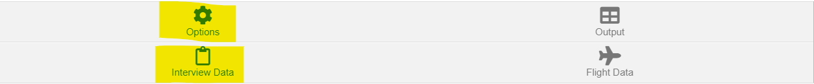
</p>

Next, the tool automatically identifies which raw data files contain interviews, and places then in the list as shown below. Generally, you will want to include all files, but this box allows you to prevent some sources from being included in the final data set.

<p align="center">
  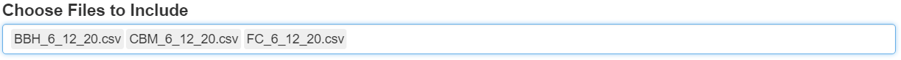
</p>

The next four boxes look like this:

<p align="center">
  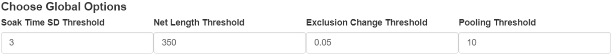
</p>

**You are advised to not edit the values in these boxes unless you have a good reason.** They control some under-the-hood options for how data are treated and when some records should be deemed unreliable. 

Here is what each controls (_most users can skip these bullets_):

* **Soak Time SD Threshold**: Reported soak times longer than than this many standard deviations away from the mean of all other interviews for a given gear type will be considered outliers and deemed unreliable. The default is 3.
* **Net Length Threshold**: Reported net lengths (in feet) longer than this will be considered outliers and deemed unreliable. The default is 350.
* **Exclusion Change Threshold**: If when an interview is excluded and the estimated catch per trip of all salmon species changes by greater than this proportion, it will be considered an outlier and its catch rate information will be deemed unreliable. The default is 0.05 (or 5%). For example, suppose with all interviews, the average catch per trip is 50 salmon. If leaving out a single interview changes this estimated average catch per trip to be less than 47.5 or greater than 52.5, that interview is considered an outlier.
* **Pooling Threshold**: If there are very few interviews for to inform a geographic stratum, then data should be shared with a neighboring stratum. This number represents the minimum number of stratum-specific interviews that must be present to not share data. The default is 10. For example if stratum D1 has only 5 interviews, then data from stratum C will be used as well when estimating harvest for stratum D1.

Click the "Update Options" button and "Load Raw Data Files" button displayed below (in that order):

<p align="center">
  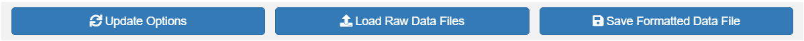
</p>

After a few seconds, two tables will display under the buttons:

<p align="center">
  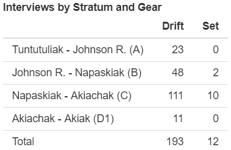
</p>

<p align="center">
  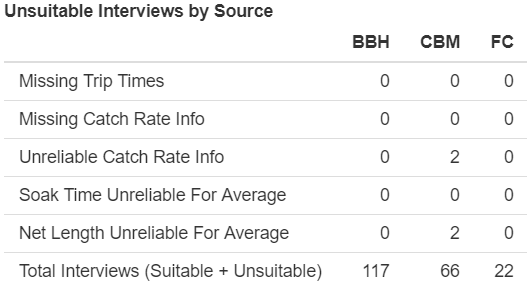
</p>

The first shows how many interviews are available within each geographic stratum by gear type. The second shows how many interviews were deemed unsuitable for a range of reasons by data source. In the above example, we can see that two interviews were deemed to have unreliable net lengths and catch rate info. This does not necessarily mean that there are 4 bad records, it could be the same two records triggering both flags.

Additionally, there may be several warnings that pop up in the background behind the tool and in the R console immediately after you click "Load Raw Data Files". These warnings just let you know some records had some issues and how the program handled it. These messages may include:

* **Impossible soak time recorded**: if a fisher reports that their net was soaking for longer than their trip lasted, you will see this warning returned:

    ```{r, comment = NA}
    cat("Warning: X interview(s) had soak duration reported longer than trip duration.\nFor these records, the soak duration has been set to the trip duration,\nand a note has been included in the output.")
    ```

    The warning notifies you of how it was handled: the erroneous soak times have been edited to be the trip duration.

* **Impossible trip times**: if the trips times are entered such that the trip ended before it started, you will see this warning returned:

    ```{r, comment = NA}
    cat("Warning: X interview(s) had impossible trip times reported.\nFor these records, the trip times have been set to NA,\nand a note has been included in the output.")
    ```

    The warning notifies you of how it was handled: the erroneous trip times have been converted to `NA` values. However, you may want to find these records in the raw data and see if this is a data entry error -- the "Output" tab will help you find these and other cases that need addressing in the raw data.

* **Missing gear type**: if a record has an `NA` in the gear type column (i.e., should be drift or set nets), then the record will be discarded entirely from the data set, and this warning will be returned:

    ```{r, comment = NA}
    cat("Warning: X interview(s) had missing gear type information.\nThese records have been discarded since they\ncannot be used for anything.")
    ```

* **Invalid stratum values**: The stratum columns must contain one of these values: `A`, `B`, `C`, `D1`, or `NA`. If another stratum value is found in the data, the corresponding records will be discarded and this warning will be returned:

    ```{r, comment = NA}
    cat("Warning: There were X records with invalid stratum values: [invalid values here]\nThey have been discarded.")
    ```

* **Highly influential records**: if a record has a large influence on the average catch per trip (i.e., excluding it results in a meaningful change in the average), its catch rate data will not be used when calculating averages and this warning will be returned:

    ```{r, comment = NA}
    cat("Warning: X interview(s) had a large influence on the average catch per trip.\nFor these records, the catch rate info has been deemed unreliable,\nand the soak time and net length will not be used in the average.")
    ```
    
* **Assuming all trips started and ended the same day**: if your interview data files contain only a single `date` column, and not `date.start` and `date.end`, you will see this warning (potentially multiple times, once per interview data file): 

    ```{r, comment = NA}
    cat("Warning: Only the 'date' column was found in the raw data, not 'date_start' and 'date_end'.\nIt is thus assumed that all trips started and ended on the same date.")
    ```

    See the raw data format `r KuskoHarvEst:::link_to_doc("01-raw-data.html", "instructions")` for more details.  

However, you may get this error and the tool will close automatically:

```{r, comment = NA}
cat("Error: More than one unique start date was found in the interview data:\n[the dates listed here]\nYou must edit the raw data to ensure all interviews are from trips that started on the same day.")
```

The error message is intended to be informative: it says that trips that started on multiple days are contained in the same data file. 'KuskoHarvEst' prohibits this, so you must go to the raw interview files and find the dates that are not the same and either delete the bad records or fix them if it is the result of a typo.

Another error that will cause the tool to close automatically is this:

```{r, comment = NA}
cat("Error: The data source name was not recognized.\nAccepted values are: ADFG, BBH, FC, CBM, LE.\nPlease change the data file name to match one of these data sources, or notify the software developer if a new data source has been added.")
```

This error indicates a problem with the name of an interview data file. 

### Output Tab

You may want to explore the data a bit before clicking the "Save Formatted Data File" button shown above. Navigate to this tab:

<p align="center">
  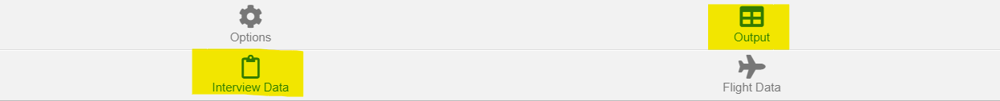
</p>

where you will see a table with options allowing you to filter which records are displayed:

<p align="center">
  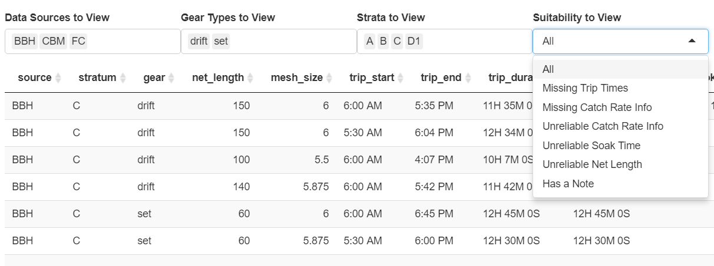
</p>

You can filter the data by data source, gear type, geographic stratum, and the various reasons why an interview may be considered unreliable.

If you find a typo in the data set, you must close the tool, fix the error in the raw data file, and restart the tool again.

**When you are done exploring the data set, make sure to navigate back to the "Options" tab, and click "Save Formatted Data File".** You should find two new files called `YYYY_MM_DD_options.rds` and `YYYY_MM_DD_interview_data.rds` in the `data-use` folder. You will not be able to open these files directly -- they are used by R automatically in later steps. 

## Flight Data Preparation

When you are done with the interview data steps, navigate to the flight data tab:

<p align="center">
  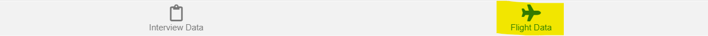
</p>

where you will see this page:

<p align="center">
  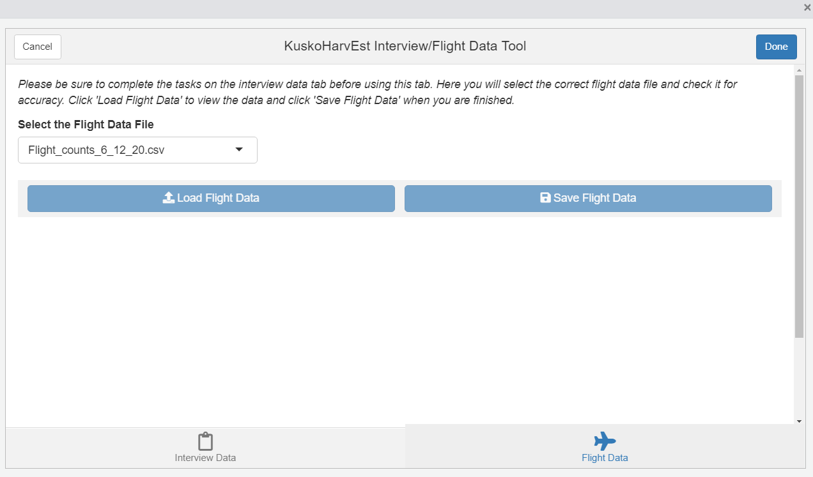
</p>

Note that you will not be able to click the "Load Flight Data" button until after you have completed the steps in the interview data tab.

Make sure the correct flight data file is selected, then click "Load Flight Data". A table like the one displayed below will appear with the formatted flight data:

<p align="center">
  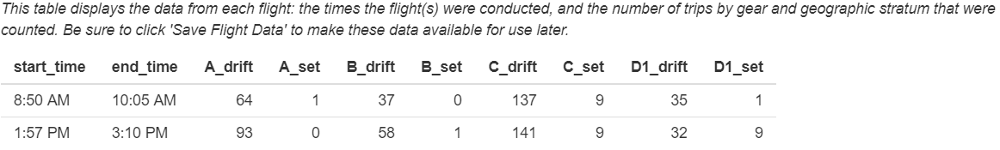
</p>

If the opportunity allowed both drift and set net gears, then a figure like the one displayed below will appear showing the reported start and end times of each trip, along with the times each flight was active. The line types indicate how many flights the trip could have been counted on:

* Solid blue: trip could not have been counted via aerial flight
* Solid black: trip was counted on only one flight
* Dashed black: trip was counted on two flights
* Dotted black: trip was counted on three flights

<p align="center">
  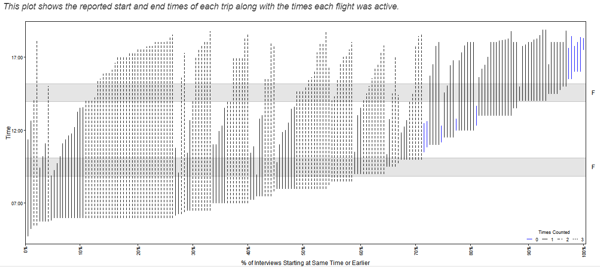
</p>

**When you are done viewing these outputs, make sure click "Save Flight Data".** You should find a new file called `YYYY_MM_DD_flight_data.rds` in the `data-use` folder. You will not be able to open this file directly -- it is used by R automatically in later steps.

When you are done with both the interview and flight data tabs and have ensured that the all exported data files are found in the `data-use` folder, you may click the "Done" button at the top right to exit the tool.
:

<p align="center">
  
</p>
