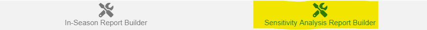
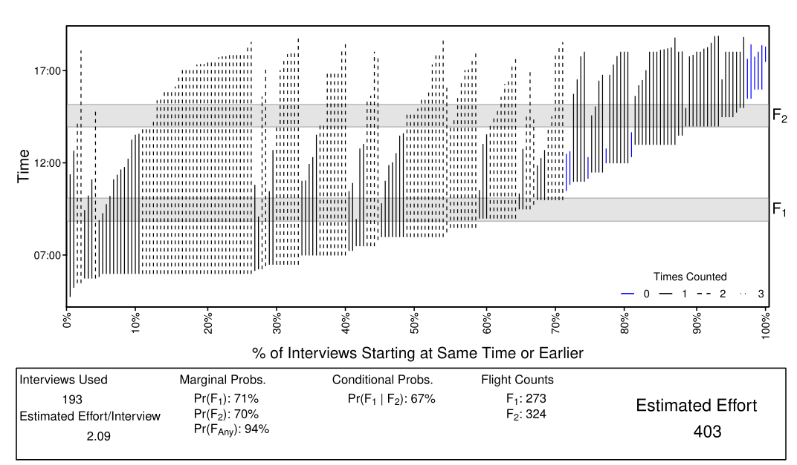

---

```{r setup, include=FALSE}
knitr::opts_chunk$set(echo = FALSE)
```

_This document describes how to use the report builder tool, which allows you to select which content to display in the output reports and build them._

This tool helps you build two documents:

* **In-Season Estimate Report**: which summarizes key features of the input data and output estimates for consideration by managers and stakeholders.
* **Sensitivity Analysis Report**: which summarizes output from various analyses that leave out chunks of data and recalculate the estimates. These kinds of analyses give you an idea of how robust the estimate you obtained was based on the data, but are not generally shared outside of the team of people conducting technical reviews of the estimates.

**Steps to Complete Before Using this Tool**:

1. Create a new R project (instructions `r KuskoHarvEst:::link_to_doc("00-general.html")`)
2. Organize the raw data files and place them in the `data-raw` folder of your project (instructions `r KuskoHarvEst:::link_to_doc("01-raw-data.html")`)
3. Enter the opportunity meta-data (instructions `r KuskoHarvEst:::link_to_doc("02-meta-data-tool.html")`)
4. Prepare the raw data files into a standardized format (instructions `r KuskoHarvEst:::link_to_doc("03-interview-flight-data-tool.html")`)

After you have completed these steps, you are ready to proceed with building the reports. Navigate to the RStudio addins menu, and select the highlighted option: 

<p align="center">
  
</p>

This window will open within RStudio:

<p align="center">
  
</p>

Clicking the link that says "Get Help with Using this tool" will open this document.

**NOTE**: this tool checks to make sure you have completed the steps leading up to it, and will return errors if it detects a problem.

* If you attempt to do this step without having first completed the meta-data entry step, you will receive this error:

    ```{r, comment = NA}
    cat("Error: No meta-data file detected - you must run the meta-data tool before using this tool.")
    ```

* If you attempt to do this step but have not properly completed the interview data preparation steps, you will receive this error:

    ```{r, comment = NA}
    cat("Error: No interview data file detected - you must run the interview/flight data tool before this tool.")
    ```

* If you attempt to do this step but have not properly completed the flight data preparation steps, you will receive this error:

    ```{r, comment = NA}
    cat("Error: No flight data file detected - you must run the interview/flight data tool before this tool.")
    ```

## In-Season Report Builder Tab

First, ensure you are on this tab of the tool:

<p align="center">
  
</p>

The first item you can change is how many bootstrap samples to run.

<p align="center">
  
</p>

The bootstrap procedure is used to estimate uncertainty in harvest estimates, and the more samples you run, the longer the calculations take. Thus, for early versions of the document, you may want to reduce this number to make sure everything is working properly. For final estimates, be sure to set this to 1,000.

Next, you will need to check or uncheck these boxes to control what content you want to include in the output document:

<p align="center">
  
</p>

Here is what each item controls:

* **Mark as Draft**: If checked, this will include a "Draft" watermark on each page of the document, indicating that it is not yet considered finalized. When you are ready to make the estimate final, run the tool with this box unchecked. 

* **Make Set Net Harvest Estimate**: If checked, a set net harvest estimate will be produced and reported. In some rare cases, you may deem that set net interviews are too sparse to provide a reliable estimate (for example, if the effort estimate is 30, but only 1 or 2 interviews were collected). If this is the case, uncheck this box and the set net harvest estimate will not be produced (but an effort estimate will be).

* **Include Johnson River Proximity Table**: If checked, a table like the one shown below will be included in the document. Uncheck this box if you do not wish to display this table.

<p align="center">
  
</p>

* **Include Harvest Goal Attainment Table**: If checked, a table like the one shown below will be included in the document. Uncheck this box if you do not wish to display this table.

<p align="center">
  
</p>

* **Include Detailed Appendix**: If checked, a set of tables summarizing interview quantities across different geographic strata will be displayed at the end of the document. Uncheck this box if you do not wish to display this content.

<p align="center">
  
</p>

* **Present Some Summaries for Chum and Sockeye Separately**: If checked, the histograms and appendix tables will show summaries for chum and sockeye salmon separately. The default (unchecked) will show summaries for these species summed together as "chum+sockeye".

* **Include Appendix with Non-Salmon Harvest Estimates**: If checked, an appendix will be added to the output that displays estimated harvest of non-salmon species.

When you are done selecting these options, click the "Save Rmarkdown Source File" button and then the "Build PDF Report" button (note that you cannot click the second without clicking the first button). After you click "Build PDF Report", you will see some text appear in the R console behind the tool indicating that calculations are happening. When these are complete, a PDF file will automatically be opened showing you the results. **If you wish to make changes to the PDF file after it has already been created, close the PDF file if it is still open, reselect the correct settings, then click both buttons again.**

<p align="center">
  
</p>

You can find several new files in your project folder now:

* `KuskoHarvEst_YYYY_MM_DD.Rmd`: This is the Rmarkdown source file that gets created automatically (or overwritten if it already exists) when you click "Save Rmarkdown Source File". It contains the code to run the estimation analysis and is formatted to produce a nice PDF report. You should not need to edit this file by hand, but if you know what you are doing and you would like to do so, you are recommended to save it under a different file name first. This will prevent your manual changes from being overwritten if you run the report builder tool again.

* `output/KuskoHarvEst_YYYY_MM_DD.pdf`: This is the PDF output file.

* `output/KuskoHarvEst_bootstrap_YYYY_MM_DD.csv`: This file contains the individual bootstrap values of harvest estimates. This file may be useful in building the season-end report or may be requested from you by the person who creates the in-season assessment documents.

## Sensitivity Analysis Report Builder Tab

To build the sensitivity analysis document, navigate to this tab:

<p align="center">
  
</p>

where you will find this page:

<p align="center">
  
</p>

This part of the tool works very similarly to the previous tab, so consult that section of this document for details on exactly how to use it. The calculations behind sensitivity analyses take quite a bit longer than for the main document, so be prepared to wait several minutes if using the full 1,000 bootstrap samples.

There is one additional setting for sensitivity analyses:

<p align="center">
  
</p>

The checkbox labeled **Include Trip Time Plots**, if checked, will include many plots that look approximately like this:

<p align="center">
  
</p>

These figures are useful, but don't display any critical information that isn't already summarized in the other tables within the output document. Thus, their inclusion is optional.

When you are done building the reports, you may click the "Done" button at the top right to exit the tool.

<p align="center">
  
</p>
